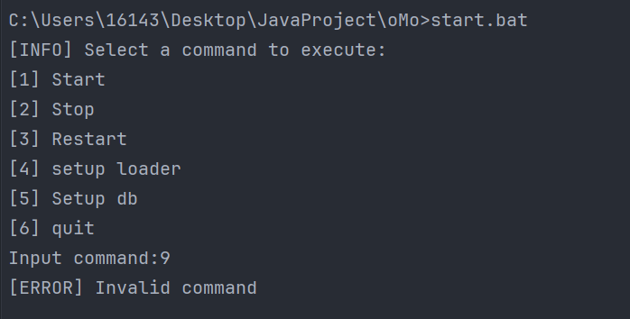
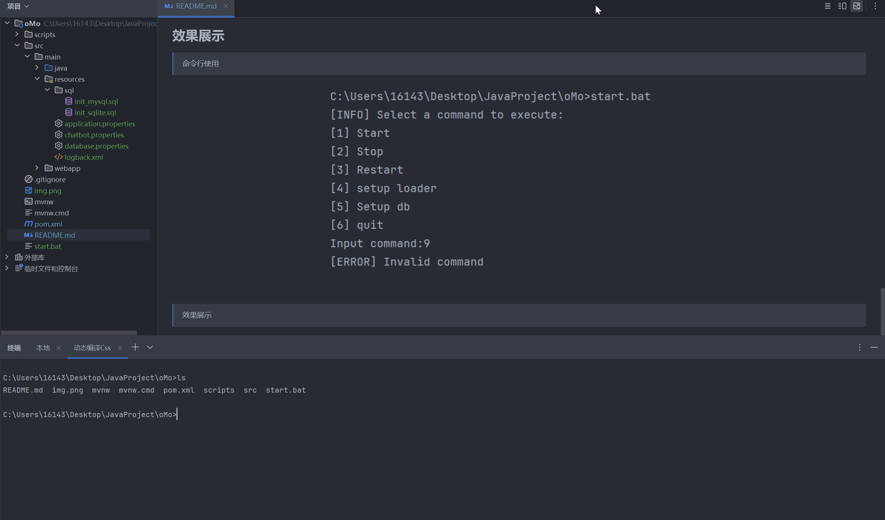
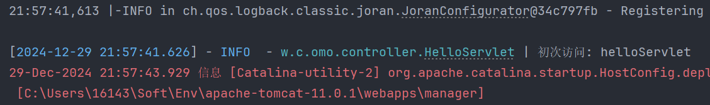

# oMo 通用管理系统

> 采用 tailwindcss + daisyui 编写

## 使用

+ 执行脚本启动

```shell
start.bat
```

## JSP 开发

> JSP 编写位置: `src/main/webapp/WEB-INF/jsp`

+ 基础引入

```html

<html lang="en">
<head>
    <meta charset="UTF-8">
    <meta name="viewport" content="width=device-width, initial-scale=1.0">
    <title>跳转页面</title>
    <link rel="stylesheet" href="../assets/css/tailwind.output.css">
</head>
<body class="h-screen flex items-center justify-center bg-gradient-to-bl from-blue-500 to-cyan-500">
<div class="container mx-auto text-center">
    <div class="mb-8">
        <span class="text-9xl text-white rotate">✈️</span>
    </div>
    <h1 class="text-6xl font-bold text-white mb-4">303</h1>
    <h2 class="text-3xl text-white mb-8">别急，我们正带您前往新地方！</h2>
    <p class="mt-8 text-white">如果您的浏览器没有自动跳转，请点击下面的链接:</p>
    <a href="/" class="error-href">手动跳转</a>
</div>
</body>
</html>
```

## Java-Servlet 开发

> Servlet 编写位置: `src/main/java/com/oMo/servlet`

```java
package work.comeback.omo.controller;

import jakarta.servlet.annotation.WebServlet;
import jakarta.servlet.http.HttpServlet;
import jakarta.servlet.http.HttpServletRequest;
import jakarta.servlet.http.HttpServletResponse;

import java.io.IOException;
import java.io.PrintWriter;

@WebServlet(name = "helloServlet", value = "/hello-servlet")
public class HelloServlet extends HttpServlet {
    private String message;

    public void init() {
        message = "Hello World!";
    }

    public void doGet(HttpServletRequest request, HttpServletResponse response) throws IOException {
        response.setContentType("text/html");

        // Hello
        PrintWriter out = response.getWriter();
        out.println("<html><body>");
        out.println("<h1>" + message + "</h1>");
        out.println("</body></html>");
    }
}
```

## 配置日志 Logger

> 采用 log4j 进行日志输出

路径: `src/main/resources/log4j.properties`

+ 通用:
    ```properties
    log4j.rootLogger=INFO, stdout
    log4j.appender.stdout=org.apache.log4j.ConsoleAppender
    log4j.appender.stdout.layout=org.apache.log4j.PatternLayout
    log4j.appender.stdout.layout.ConversionPattern=%d{yyyy-MM-dd HH:mm:ss} %-5p %c{1}:%L - %m%n
    ```

+ 定制 - `logback.xml`
    ```xml
      <configuration>
        <appender name="CONSOLE" class="ch.qos.logback.core.ConsoleAppender">
            <withJansi>true</withJansi> <!-- 启用 ANSI 支持 -->
            <encoder>
                <pattern>[%highlight(%d{yyyy-MM-dd HH:mm:ss.SSS}){FATAL=red bold, ERROR=red, WARN=yellow, INFO=blue,
                    DEBUG=green, TRACE=cyan}] - %highlight(%-5level){FATAL=red bold, ERROR=red, WARN=yellow, INFO=blue,
                    DEBUG=green, TRACE=cyan} - %cyan(%logger{36}) | %msg%n%ex
                </pattern>
            </encoder>
        </appender>
        <root level="info">
            <appender-ref ref="CONSOLE"/>
        </root>
    </configuration>
    ```

---

## Web 配置

> 项目开发应遵循: 约定优于配置
>
> 提倡使用预定义的规则和模式来减少显式配置，从而简化开发过程并提高代码的可读性和一致性。

+ 配置文件 - 应用: [src/main/resources/application.properties](src/main/resources/application.properties)
  ```properties
  # [Application]
  appTitle=oMo
  appVersion=1.0
  appPort=8080
  appAddress=localhost
  appAuthor=Fromsko
  adminPassword=admin123
  adminEmail=hnkong666@gmail.com
  ```

+ 配置文件 - 数据库: [src/main/resources/database.properties](src/main/resources/database.properties)
  ```properties 
  # [Database] => mysql | sqlite
  dbType=sqlite
  
  # [MySQL] => { url, user, pwd }
  mysqlUrl=jdbc:mysql://localhost:3306/Qweb
  mysqlUser=root
  mysqlPwd=root
  
  # [SQLite] => default
  sqliteUrl=jdbc:sqlite:C:/JspWeb.db
  ```

+ 配置文件 - 聊天机器人 [src/main/resources/chatbot.properties](src/main/resources/chatbot.properties)
  ```properties
  # [ChatBot]
  chatType=local
  chatModel=qwen-plus
  chatUrl=https://dashscope.aliyuncs.com/compatible-mode/v1/chat/completions
  chatKey=sk-xxxx
  defaultPrompt=You are Tom.
  ```

+ 配置文件 - 日志: [src/main/resources/logback.xml](src/main/resources/logback.xml)
  ```xml 
    <configuration>
        <appender name="CONSOLE" class="ch.qos.logback.core.ConsoleAppender">
            <withJansi>true</withJansi> <!-- 启用 ANSI 支持 -->
            <encoder>
                <pattern>[%highlight(%d{yyyy-MM-dd HH:mm:ss.SSS}){FATAL=red bold, ERROR=red, WARN=yellow, INFO=blue,
                    DEBUG=green, TRACE=cyan}] - %highlight(%-5level){FATAL=red bold, ERROR=red, WARN=yellow, INFO=blue,
                    DEBUG=green, TRACE=cyan} - %cyan(%logger{36}) | %msg%n%ex
                </pattern>
            </encoder>
        </appender>
        <root level="info">
            <appender-ref ref="CONSOLE"/>
        </root>
    </configuration>
  ```

## 效果展示

> 命令行使用

<div style="display: flex; justify-content: center; align-items: center;">
  
</div>

---
> 效果展示

<div style="display: flex; justify-content: center; align-items: center;">
  
</div>

---
> 日志展示

<div style="display: flex; justify-content: center; align-items: center;">
  
</div>